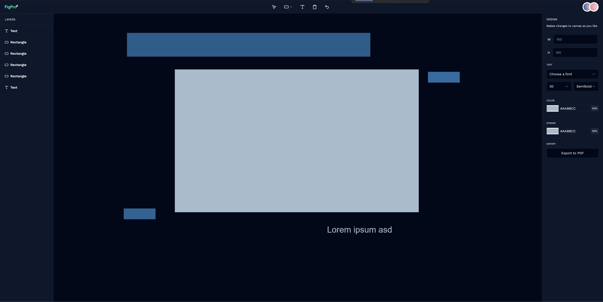

<p align="center">
  
</p>

<p align="center">
  
</p>

<br>

## 🧪 Tecnologias

Esse projeto foi desenvolvido com as seguintes tecnologias:

- [NextJS](https://nextjs.org/)
- [Tailwind CSS](https://tailwindcss.com/)
- [TypeScript](https://www.typescriptlang.org/)
- [Liveblocks](https://liveblocks.io/)
- [PNPM](https://pnpm.io/)
- [Framer Motion](https://www.framer.com/motion/)
- [Fabric.js](http://fabricjs.com/)
- [Shadcn](https://ui.shadcn.com/)

## 💻 Projeto

Um clone minimalista do Figma com recursos de colaboração ao vivo com bate-papo do cursor, comentários, reações e desenho (formas, upload de imagem) na tela usando fabric.js.

## 🚀 Como executar

Clone o projeto e acesse a pasta do mesmo.

```bash
$ git clone https://github.com/CesarNeo/figma-clone.git
$ cd figma-clone
```

Para iniciá-lo, siga os passos abaixo:

```bash
# Instalar as dependências
$ pnpm install

# Iniciar o projeto
$ pnpm run dev
```

O app estará disponível no seu browser pelo endereço http://localhost:3000.
